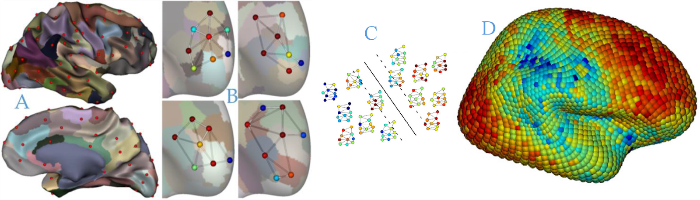

 

## Unlocking the Mysteries of the Brain with Graph-Based Machine Learning

In the fascinating world of neuroscience, understanding the brain's
intricate structure is key to unlocking the secrets of psychiatric and
neurological disorders. Imagine if we could map the brain's folds and curves
to reveal patterns that indicate health or disease. This is precisely what our
cutting-edge PhD project aims to achieve, leveraging the power of graph-based machine learning (GML)  and Graph Neural Networks (GNN).

### Project Overview
Our research focuses on enhancing the representation and analysis of
neuroimaging data, particularly from MRI scans, using innovative GML
techniques. By developing advanced models, we aim to identify individual traits
such as gender and pathology with. What's more, we are embedding principles of
fairness into our models to ensure they are robust against variations in data
acquisition and the natural diversity of brain structures. 

### Key Research Questions

1. **Hierarchical Information Analysis in Brain Graphs:** How can we design GML models that effectively capture and utilize hierarchical information in brain graphs for better analysis of cortical folding patterns?
2. **Robustness to MRI Variations:** Can a GML model trained on data from one MRI acquisition center generalize well to data from other centers, demonstrating robustness and enhancing the reproducibility of neuroimaging studies?
3. **Local Variation and Cognitive Functions:** How can GML approaches help us identify and analyze local variations in brain anatomy, and what can these variations tell us about cognitive functions and neurological conditions?

### Methodology and Resources

Our PhD candidate will have access to premier datasets, including:
- **[Human Connectome Project](http://www.humanconnectomeproject.org/):** Featuring top-quality MRI data from 1200 individuals.
- **[UK Biobank](https://www.ukbiobank.ac.uk/):** Offering multimodal MRI data from over 10,000 individuals.

### Supervisors and Research Environment

The project will be hosted at INSA Rouen, within the LITIS laboratory, and will be co-supervised by experts in the field:
- **Benoit Gaüzère**
- **Guillaume Auzias**
- **Sylvain Takerkart**
- **Paul Honeine**

Our multidisciplinary team brings together expertise in machine learning, computational anatomy, and neuroscience. The candidate will benefit from collaborations with leading research teams across multiple institutions.

### Candidate Profile

We are seeking a passionate and dedicated PhD candidate with:
- A Master’s degree in data science, computer engineering, or a related field.
- Proficiency in Python programming.
- Strong knowledge or experience in machine learning and data science.
- Experience with graph structures is a plus.
- High motivation and an interest in neuroscience.
- Excellent reading, writing, and communication skills in English.

### How to Apply

Ready to embark on this exciting journey? Send your resume, academic results, and links to code or scientific papers to the following contacts. Please include "[FAMOUS]" in the subject line of your email:

- **Benoit Gaüzère:** [benoit.gauzere@insa-rouen.fr](mailto:benoit.gauzere@insa-rouen.fr)
- **Paul Honeine:** [paul.honeine@univ-rouen.fr](mailto:paul.honeine@univ-rouen.fr)
- **Guillaume Auzias:** [guillaume.auzias@univ-amu.fr](mailto:guillaume.auzias@univ-amu.fr)
- **Sylvain Takerkart:** [sylvain.takerkart@univ-amu.fr](mailto:sylvain.takerkart@univ-amu.fr)

full offer is available [here](phd_famous.pdf).

### Publications for Further Reading

1. Lefrere, A., Auzias, G., et al. (2023). "Global and Local Cortical Folding Alterations Are Associated with Neurodevelopmental Subtype in Bipolar Disorders: A Sulcal Pits Analysis," *Journal of Affective Disorders*.
2. Auzias, G., Brun, L., Deruelle, C., Coulon, O. (2015). "Deep sulcal landmarks: Algorithmic and conceptual improvements in the definition and extraction of sulcal pits," *NeuroImage*.
3. Takerkart, S., Auzias, G., Brun, L., Coulon, O. (2017). "Structural graph-based morphometry: A multiscale searchlight framework based on sulcal pits," *Medical Image Analysis*.
4. Yadav, R., Dupé, F.-X., Takerkart, S., Auzias, G. (2024). "Geometric Deep Learning for Sulcal Graphs," *IEEE International Symposium on Biomedical Imaging*.
5. Balcilar, M., Héroux, P., Gaüzère, B., Vasseur, P., Adam, S., Honeine, P. (2021). "Breaking the Limits of Message Passing Graph Neural Networks," *International Conference on Machine Learning*.
6. Stanovic, S., Gaüzère, B., Brun, L. (2023). "Maximal independent sets for pooling in graph neural networks," *International Workshop on Graph-Based Representations in Pattern Recognition*.

Join us in pushing the boundaries of neuroscience and machine learning!

