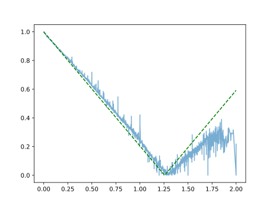
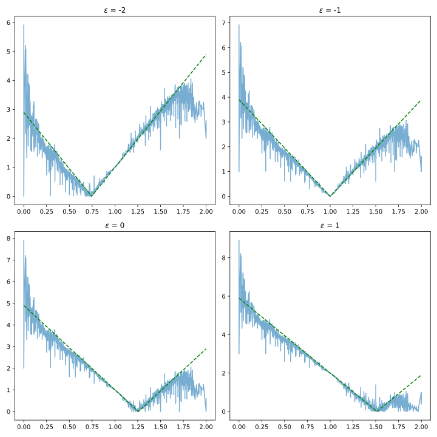

This post revisits a simple idea from our ICLR 2021 paper: most graph convolutions can be understood as **filters on graph signals**, and filters on graph can be reimplemented as convolution operators. This point of view helps connect spectral and spatial GNNs, and explains why many popular models behave similarly.

Historically, graph convolutions were defined either in the spectral domain (via
the Laplacian) or in the spatial domain (via neighborhood aggregation). In
practice, both describe the same object: an operator acting on node
features.

Let’s start with a simple example: the Karate Club graph.



From this graph, we can compute its adjacency matrix, and from the adjacency its (normalized) Laplacian. 
<div style="display: flex; justify-content: center; gap: 2rem; flex-wrap: wrap;">

  <div style="max-width: 300px; text-align: center;">
    
  </div>

  <div style="max-width: 300px; text-align: center;">
    
  </div>

</div>

From a spectral perspective, signals on this graph can be decomposed into eigenmodes of the Laplacian. A graph convolution then acts as a **filter** over these frequencies.

For instance, early spectral GNNs (Bruna et al., 2014; Henaff et al., 2015, or ChebNet) define convolutions as

$$
H^{(l+1)} = \sigma\big(U \Phi(\Lambda) U^\top H^{(l)} W^{(l)}\big),
$$

where $\Phi(\Lambda)$ controls which frequencies are kept or suppressed. When applied on Karate Club, these filters typically emphasize smooth (low-frequency) components.

Now consider spatial GNNs such as GCN, GIN, or GAT. They are usually written as message passing rules, operating directly on the adjacency matrix :

$$
H^{(l+1)} = \sigma\big(\tilde{D}^{-1/2} \tilde{A} \tilde{D}^{-1/2} H^{(l)} W^{(l)}\big).
$$

At first glance, they look different : one is using the eigendecomposition of Laplacian, the other one the adjacency matrix. But given the relationship between adjacency and Laplacian matrices, we may look for a correspondance. Indeed, if we inspect what these operators do on node features, we observe the same behavior: they mostly keep low frequencies and smooth the signal.

So these models look different, but behave similarly.

The natural question is: how do we go from one view to the other?

## From Spectral Filters to Spatial Kernels

Following the Theorem 1 in Balcilar 2021, given Laplacian eigenpairs $(\lambda_i, u_i)$, any spectral profile $\Phi(\lambda)$ defines a spatial operator

$$
C = U \operatorname{diag}(\Phi(\boldsymbol{\lambda})) U^\top,
$$

which leads to the standard update

$$
H^{(l+1)} = \sigma\big(C H^{(l)} W^{(l)}\big).
$$

Here, the matrix $C$ acts as a convolution operator, replacing the classic adjacency matrix $A$. Using this spectral to spatial framework, one can then define filters in the spectral domain and apply them in the spatial domain. 

```python
import numpy as np

def spectral_to_spatial(U, lambdas, phi):
    return U @ np.diag(phi) @ U.T
```

Using these defined spectral profiles : 


lead to the following spatial convolutional operators:




## From Spatial Supports to Frequency Responses

Conversely, we can also pass from a spatial operator to a spectral one, using the Corollary 1.1 in Balcilar 2021. 
given a spatial kernel $C$, its frequency response is defined as 

$$
\Phi(\boldsymbol{\lambda}) = \operatorname{diag}\big(U^\top C U\big).
$$

Such relationship allows the study of spatial GNNs in terms of spectral filtering. 

```python

def spatial_to_spectral(U, C):
    return np.diag(U.T @ C @ U)
```


Under this lens, many popular GNNs turn out to be **low-pass filters**. They smooth node features across edges, which explains their success on homophilous graphs.

<div style="display: flex; justify-content: center; gap: 2rem; flex-wrap: wrap; text-align: center;">

  <div>
    
    <div><b>GCN</b></div>
  </div>

  <div>
    
    <div><b>GIN</b></div>
  </div>

</div>

<!-- Lightbox -->
<div id="lightbox" onclick="this.style.display='none'"
     style="display:none; position:fixed; z-index:999; top:0; left:0; width:100%; height:100%;
            background:rgba(0,0,0,0.8); align-items:center; justify-content:center;">

  
</div>

<script>
function openImg(src) {
  const box = document.getElementById('lightbox');
  const img = document.getElementById('lightbox-img');
  img.src = src;
  box.style.display = 'flex';
}
</script>

## Takeaway

These two relations form the spectral<->spatial bridge.  Graph convolutions are
not just aggregation rules. They are **filters**, and their spectral profile
largely determines their behavior.

Understanding this dual view helps both to analyze existing models and to design new ones.

## Code

All figures and experiments can be reproduced from the code available on [GitHub](https://github.com/balcilar/gnn-spectral-expressive-power).

## Reference

Balcilar et al., *Analyzing the Expressive Power of Graph Neural Networks in a Spectral Perspective*, ICLR 2021.
